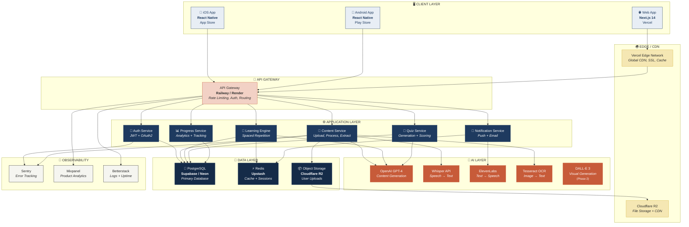
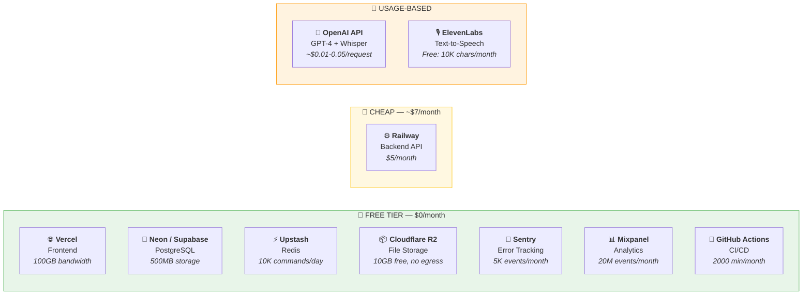
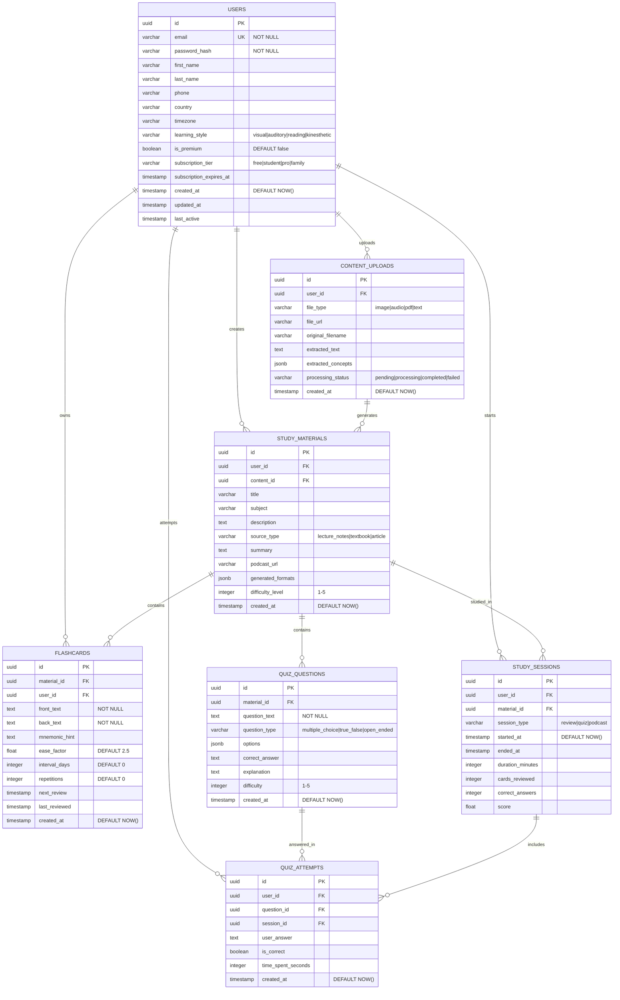
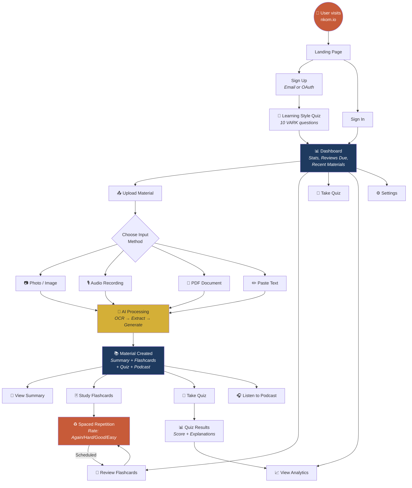
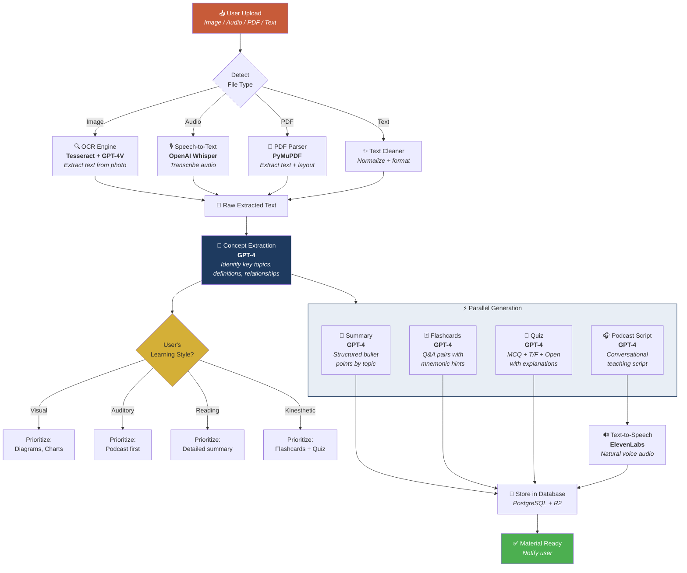
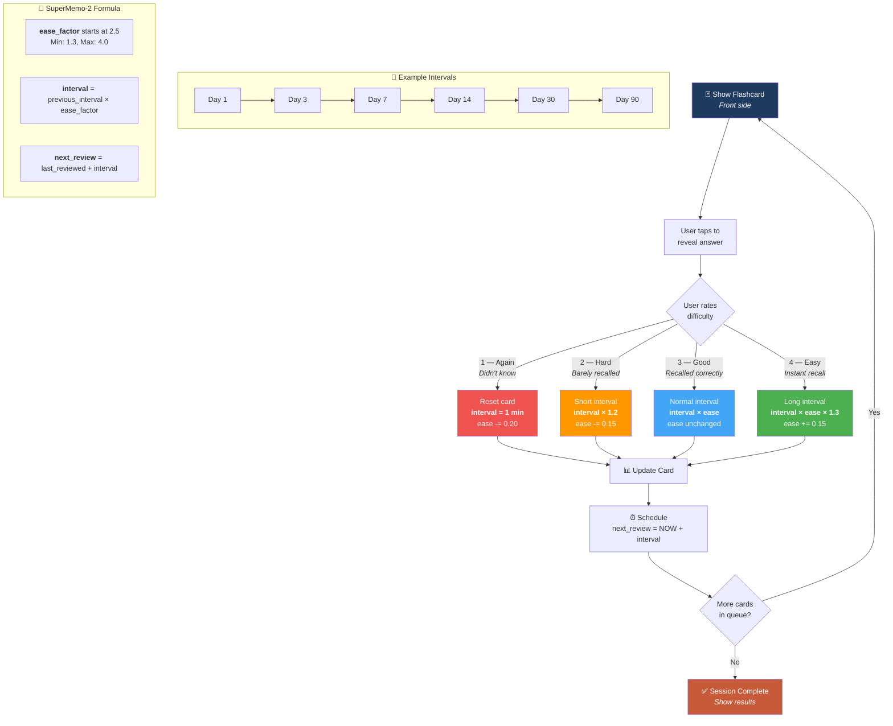
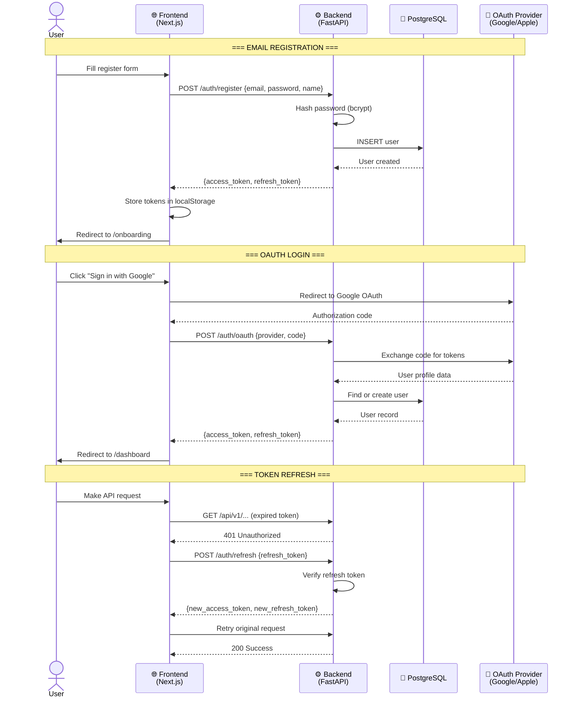
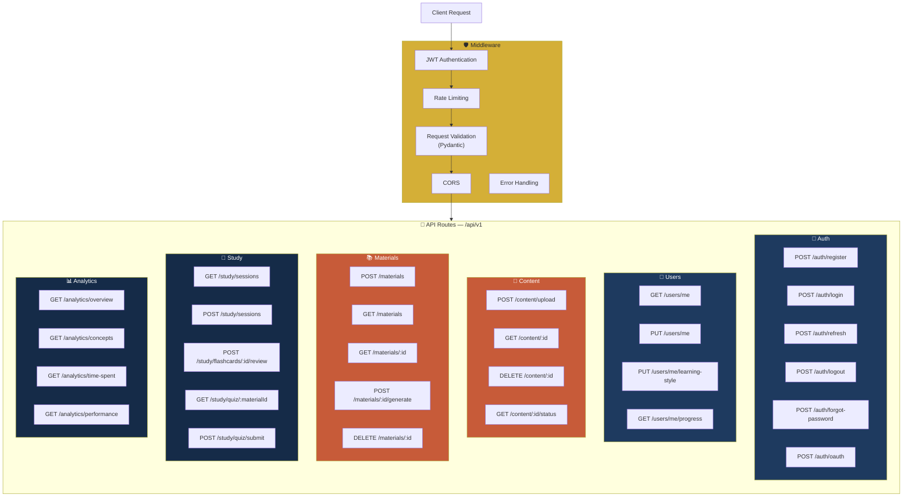
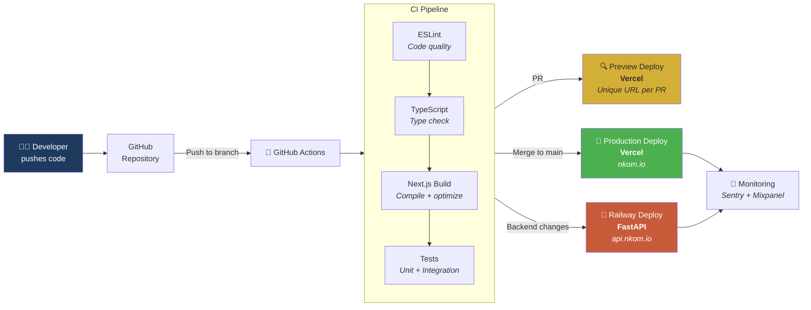

# NKOM — Architecture & Design Diagrams

> All diagrams use [Mermaid](https://mermaid.js.org/) syntax.
> View them rendered on GitHub, or paste into [mermaid.live](https://mermaid.live) for an interactive editor.

---

## Table of Contents

1. [Full Infrastructure Architecture](#1-full-infrastructure-architecture)
2. [Deployment Strategy (Budget-Friendly)](#2-deployment-strategy--cost-breakdown)
3. [Database Schema (ER Diagram)](#3-database-schema-er-diagram)
4. [User Flow — Core Journey](#4-user-flow--core-journey)
5. [AI Content Processing Pipeline](#5-ai-content-processing-pipeline)
6. [Spaced Repetition Algorithm Flow](#6-spaced-repetition-algorithm-flow)
7. [Authentication Flow](#7-authentication-flow)
8. [API Architecture](#8-api-architecture)
9. [CI/CD Pipeline](#9-cicd-pipeline)

---

## 1. Full Infrastructure Architecture

---

## 2. Deployment Strategy & Cost Breakdown

### Monthly Cost Estimate (MVP)

| Service | What | Cost | Notes |
|---------|------|------|-------|
| **Vercel** | Frontend hosting | **$0** | Hobby plan, 100GB bandwidth |
| **Neon** | PostgreSQL database | **$0** | 500MB storage, autoscale |
| **Upstash** | Redis cache | **$0** | 10K commands/day |
| **Cloudflare R2** | File uploads | **$0** | 10GB free, zero egress |
| **Railway** | FastAPI backend | **$5** | 8GB RAM, deploy from Git |
| **OpenAI** | GPT-4 + Whisper | **~$15-30** | Usage-based, ~500 users |
| **ElevenLabs** | Text-to-speech | **$0** | Free tier: 10K chars |
| **Sentry** | Error tracking | **$0** | 5K events free |
| **GitHub Actions** | CI/CD | **$0** | 2000 min/month free |
| | | **~$20-35/month** | |

---

## 3. Database Schema (ER Diagram)

---

## 4. User Flow — Core Journey

---

## 5. AI Content Processing Pipeline

---

## 6. Spaced Repetition Algorithm Flow

---

## 7. Authentication Flow

---

## 8. API Architecture

---

## 9. CI/CD Pipeline

---

## Quick Reference: Full Stack Deployment

| Layer | Service | Cost | URL |
|-------|---------|------|-----|
| **Frontend** | Vercel | Free | `nkom.io` |
| **Backend API** | Railway | $5/mo | `api.nkom.io` |
| **Database** | Neon (PostgreSQL) | Free | internal |
| **Cache** | Upstash (Redis) | Free | internal |
| **File Storage** | Cloudflare R2 | Free | `cdn.nkom.io` |
| **AI** | OpenAI API | ~$15-30/mo | API key |
| **TTS** | ElevenLabs | Free | API key |
| **Error Tracking** | Sentry | Free | dashboard |
| **Analytics** | Mixpanel | Free | dashboard |
| **CI/CD** | GitHub Actions | Free | built-in |
| | | **~$20-35/mo total** | |

---

> **How to view these diagrams:**
> 1. Push to GitHub — they render automatically in markdown
> 2. Copy any diagram block into [mermaid.live](https://mermaid.live) for interactive editing
> 3. Export as SVG/PNG from mermaid.live for presentations
